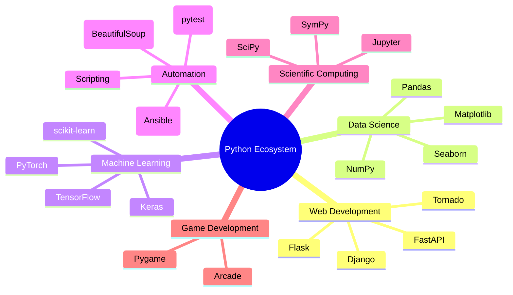
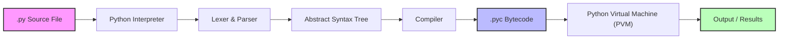

---
icon:
  type: mdi:earth
  color: 00897b
---
# Python Ecosystem Overview

Python is far more than just a programming language -- it is an entire ecosystem of tools, libraries, and frameworks that make it one of the most versatile technologies in the world.

## Python's Ecosystem

The following mindmap shows the major areas where Python is used, along with the most popular libraries and frameworks in each domain:

## How Python Executes Code

When you run a Python script, several things happen behind the scenes. Python is an **interpreted** language, but it actually compiles your code to bytecode first, then executes that bytecode on the Python Virtual Machine (PVM).

### Key Points

- **Source Code (.py)**: The human-readable Python code you write
- **Bytecode (.pyc)**: An intermediate representation, cached in the `__pycache__` directory
- **PVM**: The runtime engine that executes bytecode instruction by instruction
- Python recompiles bytecode only when the source file changes (timestamp/hash check)
- This is why Python is sometimes called "semi-compiled" -- it compiles to bytecode, not machine code

## Further Reading

- [Official Python Documentation](https://docs.python.org/3/)
- [Python Package Index (PyPI)](https://pypi.org/)
- [The Zen of Python](https://peps.python.org/pep-0020/) -- run `import this` in the REPL!