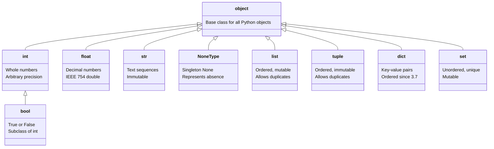
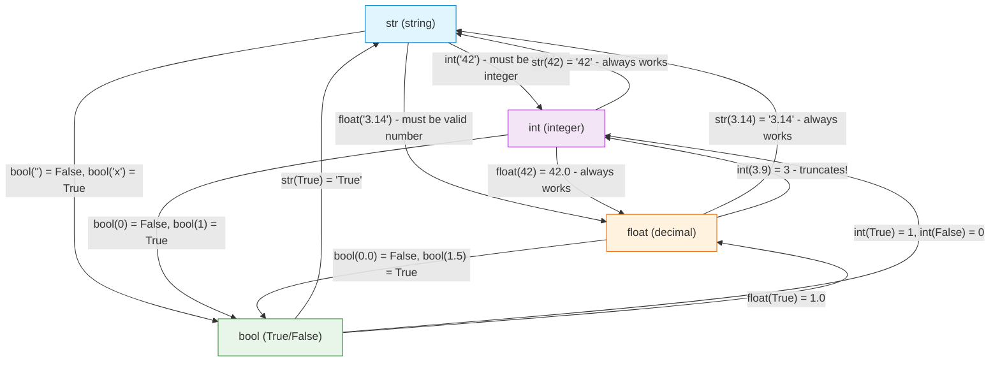

---
icon:
  type: mdi:format-list-group
  color: 00897b
---
# Type System Overview

Understanding Python's type system is essential for writing correct programs. This note provides two visual diagrams that illustrate how types are organized and how you can convert between them.

## Python Type Hierarchy

All types in Python inherit from `object`. The diagram below shows the inheritance relationships between Python's built-in types:



### Key Insight: bool is a subclass of int

This means `True` is actually `1` and `False` is actually `0`:
```python
>>> True + True
2
>>> False * 10
0
>>> isinstance(True, int)
True
```

## Type Conversion Paths

The following flowchart shows which conversions are possible between Python's core types. Green arrows indicate safe conversions that always succeed. Red arrows indicate conversions that may fail depending on the value.



### Conversion Tips

1. **str to int/float**: The string must contain a valid number, otherwise you get a `ValueError`
2. **float to int**: Uses truncation (toward zero), not rounding -- use `round()` if you need rounding
3. **Any type to bool**: Empty/zero values are `False`, everything else is `True`
4. **bool to int**: `True` becomes `1`, `False` becomes `0`