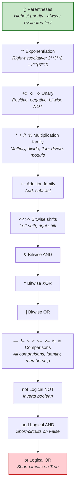

---
icon:
  type: mdi:order-numeric-ascending
  color: 00897b
---
# Operator Precedence

When Python encounters an expression with multiple operators, it needs to decide which operations to perform first. This is called **operator precedence** (sometimes called "order of operations").

## The Golden Rule

> When in doubt, use parentheses! They make your code clearer and prevent bugs.

## Precedence Hierarchy

The following diagram shows Python's operator precedence from highest priority (evaluated first) at the top to lowest priority (evaluated last) at the bottom:



## Examples

### Example 1: Arithmetic
```python
result = 2 + 3 * 4 ** 2
# Step 1: 4 ** 2 = 16     (exponentiation first)
# Step 2: 3 * 16 = 48     (multiplication next)
# Step 3: 2 + 48 = 50     (addition last)
```

### Example 2: Mixed operators
```python
result = not 3 > 2 and 5 < 10
# Step 1: 3 > 2 = True        (comparison)
# Step 2: 5 < 10 = True       (comparison)
# Step 3: not True = False     (logical NOT)
# Step 4: False and True = False  (logical AND)
```

### Example 3: With parentheses for clarity
```python
result = (not (3 > 2)) and (5 < 10)   # False
result = not ((3 > 2) and (5 < 10))   # False (different grouping, same result here)
```

## Tips for Beginners

1. **PEMDAS/BODMAS** from math class still applies for arithmetic operators
2. Comparisons have **lower** precedence than arithmetic -- `x + 1 > y` works as expected
3. `not` has **higher** precedence than `and` and `or`
4. `and` has **higher** precedence than `or` -- this matters!
5. When mixing `and` and `or`, **always use parentheses**