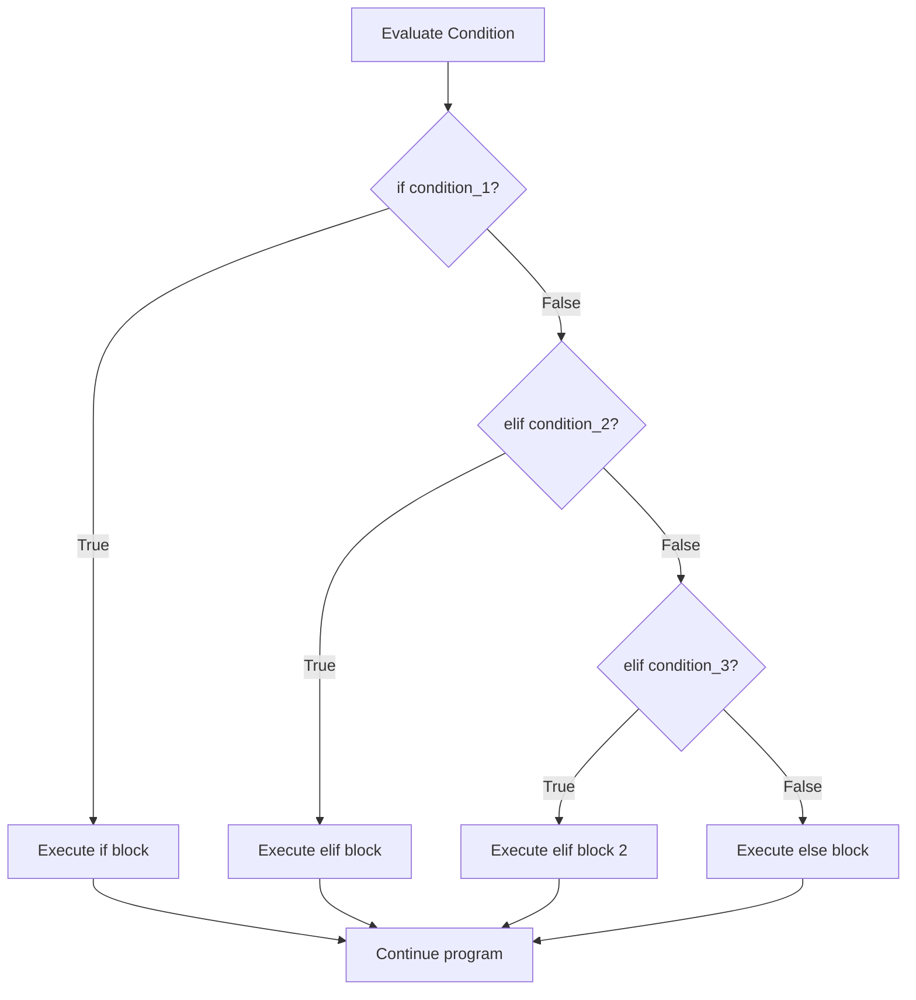
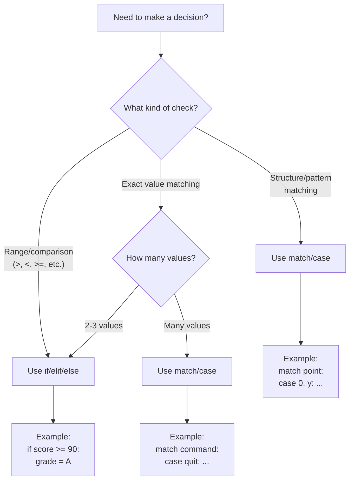

---
icon:
  type: mdi:file-tree-outline
  color: 00897b
---
# Decision Trees

## How `if/elif/else` Executes

The following flowchart shows how Python evaluates an `if/elif/else` chain from top to bottom, executing only the first matching branch.

**Key insight:** Only **one** branch ever executes. Once a condition matches, all remaining conditions are skipped entirely.

---

## `if/elif/else` vs `match/case`

This diagram compares when to use each pattern for decision-making.

**Rules of thumb:**
- Use `if/elif/else` for **comparisons** and **ranges**
- Use `match/case` for matching **specific values** or **destructuring data**
- For just 2-3 exact values, `if/elif` is perfectly fine
