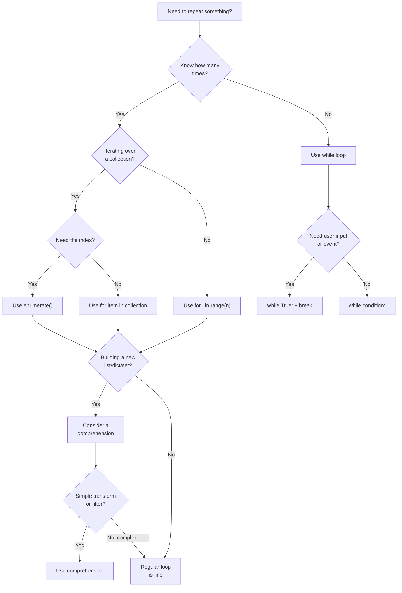

---
icon:
  type: mdi:compass-outline
  color: 00897b
---
# Loop Decision Guide

Use this flowchart to decide which loop construct to use in Python.

## Quick Reference

| I want to... | Use this |
|---|---|
| Loop over a list | `for item in my_list` |
| Loop with index | `for i, item in enumerate(my_list)` |
| Loop N times | `for i in range(n)` |
| Loop until condition | `while condition` |
| Loop over two lists | `for a, b in zip(list1, list2)` |
| Build a new list | `[expr for item in iterable]` |
| Build a new dict | `{k: v for item in iterable}` |
| Find first match | `for + break` or `next()` |
