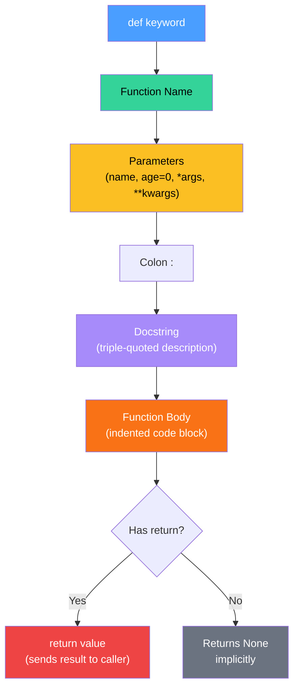
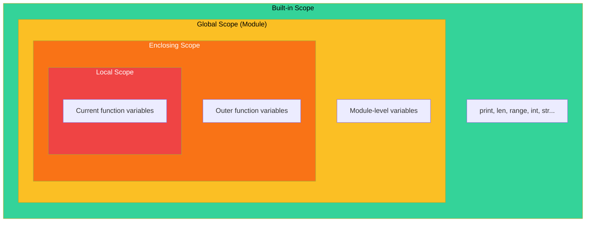

---
icon:
  type: mdi:puzzle-outline
  color: 00897b
---
# Function Anatomy

## Parts of a Function Definition

This diagram shows the key components that make up a Python function definition.

## LEGB Scope Resolution

Python looks up variable names in four nested scopes. The innermost match wins.

**How it works:**
1. Python first checks the **Local** scope (current function)
2. Then the **Enclosing** scope (any outer functions)
3. Then the **Global** scope (module level)
4. Finally the **Built-in** scope (Python's built-in names)

The first match found is used. Use `global` or `nonlocal` keywords to explicitly write to an outer scope (but prefer passing arguments and returning values instead).
