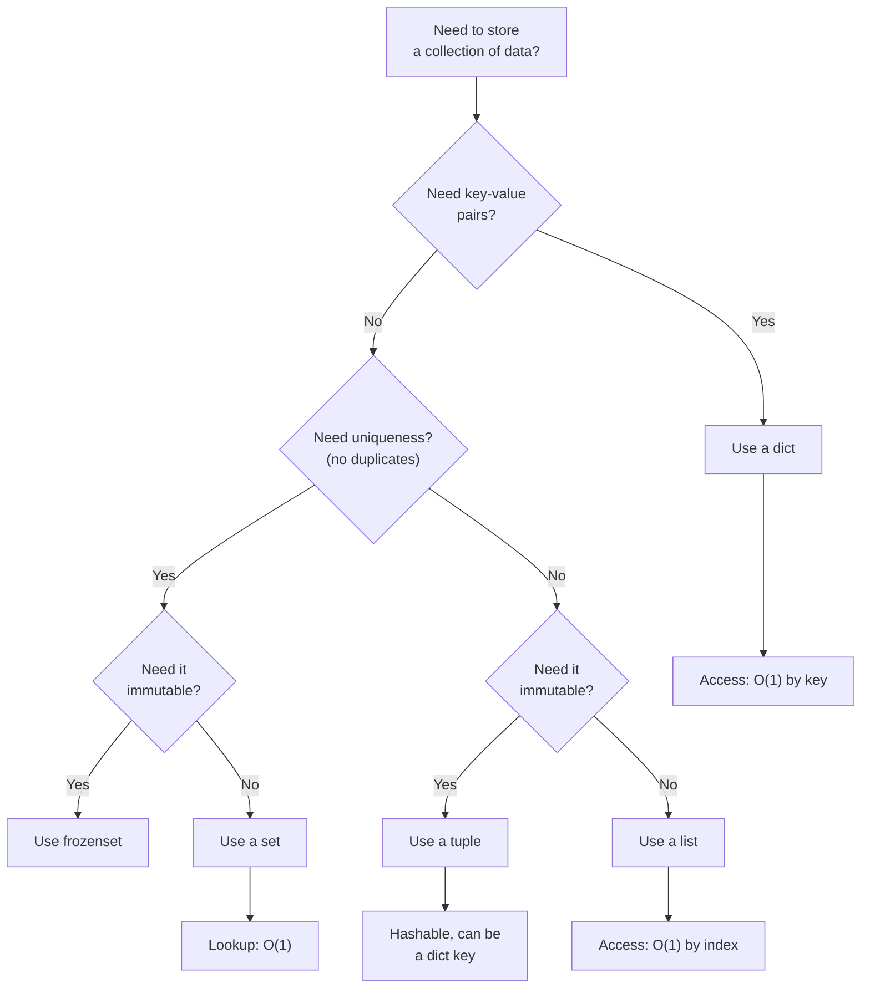
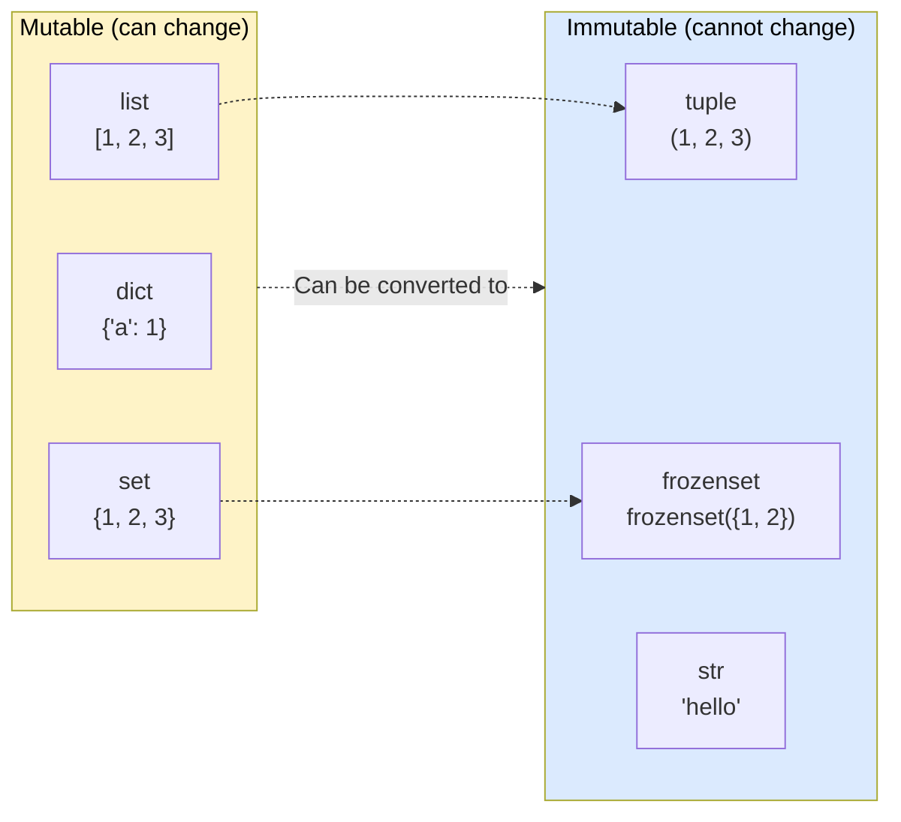

---
icon:
  type: mdi:sitemap-outline
  color: 00897b
---
# Choosing the Right Data Structure

## Decision Flowchart

Use this flowchart when you need to store a collection of data and aren't sure which type to use.

## Mutability Map

This diagram groups Python's built-in collections by whether they can be modified after creation.

## When to Use Each

| Use Case | Data Structure | Why |
|----------|---------------|-----|
| Shopping list | **list** | Ordered, items may repeat |
| RGB color | **tuple** | Fixed 3 values, immutable |
| User profile | **dict** | Named fields with values |
| Tags on a post | **set** | No duplicate tags |
| Lookup table | **dict** | Fast key-based access |
| Function returning x, y | **tuple** | Lightweight, immutable |
| Processing queue | **list** | Ordered, append/pop |
| Removing duplicates | **set** | Automatic deduplication |
