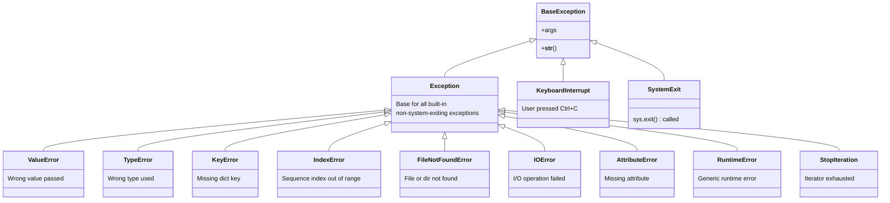
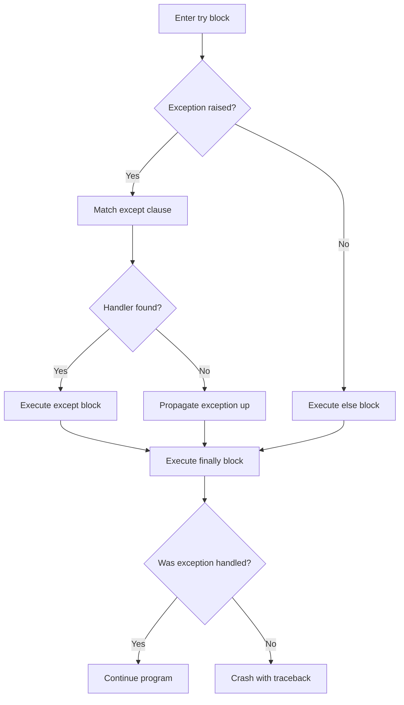

---
icon:
  type: mdi:alert-outline
  color: 00897b
---
# Python Exception Hierarchy

Understanding how Python's exceptions are organized helps you write better error handling code. All exceptions inherit from `BaseException`, but you should almost always catch from `Exception` and its subclasses.

## Exception Class Hierarchy

## try / except / else / finally Execution Flow

This diagram shows how Python evaluates each block in the exception handling structure:

### Key Takeaways

- **Never catch `BaseException`** -- this would swallow `KeyboardInterrupt` and `SystemExit`
- **Be specific** with your except clauses -- catch the narrowest exception type possible
- **The `finally` block always runs**, whether or not an exception occurred
- **The `else` block** only runs if no exception was raised in the `try` block
