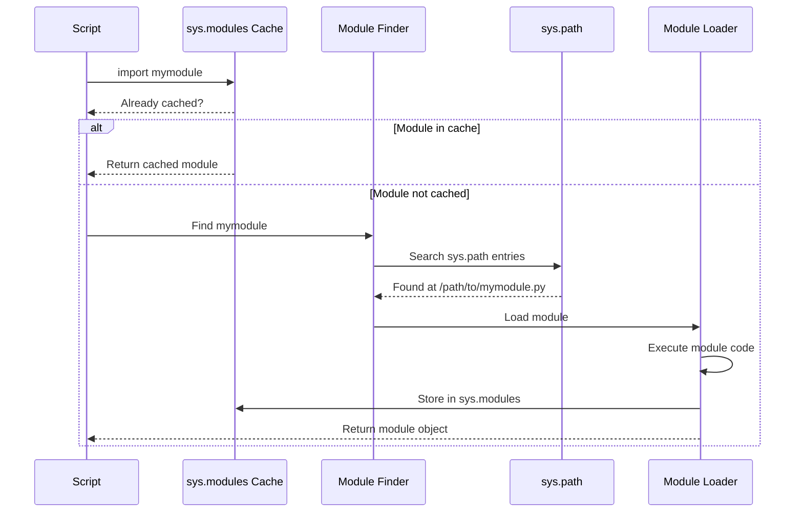
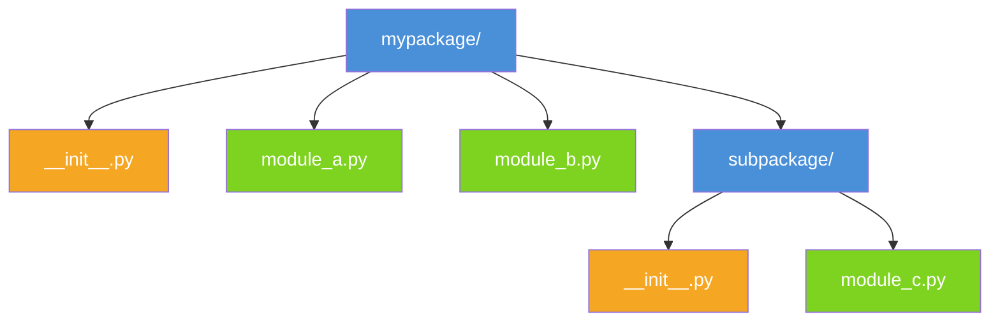

---
icon:
  type: mdi:import
  color: 00897b
---
# Module Import Flow

Understanding how Python locates and loads modules helps you debug import errors and structure your projects correctly.

## The Import Process

When you write `import mymodule`, Python goes through a specific sequence of steps to find, load, and cache the module:

## Package Directory Structure

Packages organize related modules into a directory hierarchy. Here is a typical package layout:

### Import Examples

| Statement | What It Imports |
|-----------|----------------|
| `import mypackage` | Runs `mypackage/__init__.py` |
| `from mypackage import module_a` | Imports `module_a.py` |
| `from mypackage.subpackage import module_c` | Imports nested module |
| `from mypackage.module_b import func` | Imports a specific name |

### Key Points

- **`__init__.py`** runs when the package is first imported and can define what gets exported
- **`sys.path`** is a list of directories Python searches, in order
- **Caching** in `sys.modules` means each module is executed only once, even if imported many times
- Use **relative imports** (`from . import module_a`) within packages for portability
