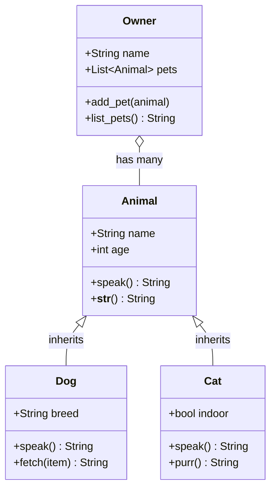
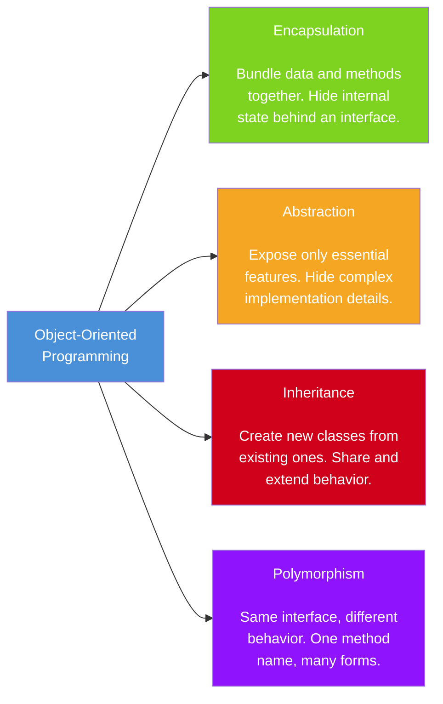

---
icon:
  type: mdi:relation-many-to-many
  color: 00897b
---
# OOP Relationships

Object-oriented design involves choosing the right relationships between classes. The two most important are **inheritance** (is-a) and **composition** (has-a).

## Class Diagram: Inheritance and Composition

This diagram shows how `Dog` and `Cat` inherit from `Animal` (is-a), while `Owner` has a composition relationship with `Animal` (has-a):

## The Four Pillars of OOP

### Quick Reference

| Principle | Key Idea | Python Example |
|-----------|----------|----------------|
| **Encapsulation** | Hide internals | `_private` attributes, `@property` |
| **Abstraction** | Simplify interface | Abstract base classes (`ABC`) |
| **Inheritance** | Reuse behavior | `class Dog(Animal)` |
| **Polymorphism** | Flexible behavior | Override `speak()` per subclass |
